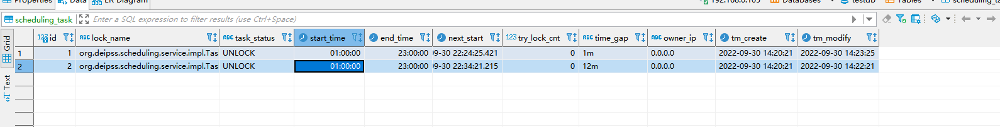

# Scheduling java task with mysql
- Multi-machine uniqueness: A task can only be performed by one machine


# Sql script
```mysql
DROP TABLE IF EXISTS `scheduling_task`;
CREATE TABLE `scheduling_task`  (
  `id` bigint(0) NOT NULL COMMENT '主键',
  `lock_name` varchar(1024) CHARACTER SET utf8 COLLATE utf8_general_ci NULL DEFAULT NULL COMMENT '锁名称，为类全路径名',
  `task_status` varchar(16) CHARACTER SET utf8 COLLATE utf8_general_ci NULL DEFAULT NULL COMMENT '锁状态',
  `start_time` time(3) NULL DEFAULT NULL COMMENT '任务开始时间',
  `end_time` time(3) NULL DEFAULT NULL COMMENT '任务结束时间',
  `next_start` datetime(3) NULL DEFAULT NULL COMMENT '下次启动时间',
  `try_lock_cnt` int(0) NULL DEFAULT NULL COMMENT '上锁次数',
  `time_gap` varchar(32) CHARACTER SET utf8 COLLATE utf8_general_ci NULL DEFAULT NULL COMMENT '任务执行间隔',
    `owner_ip` varchar(64) CHARACTER SET utf8 COLLATE utf8_general_ci NULL DEFAULT NULL,
  `tm_create` datetime NULL DEFAULT CURRENT_TIMESTAMP  COMMENT '创建时间',
  `tm_modify` datetime NULL DEFAULT CURRENT_TIMESTAMP  ON UPDATE CURRENT_TIMESTAMP COMMENT '修改时间',
  PRIMARY KEY (`id`) USING BTREE
) ENGINE = InnoDB CHARACTER SET = utf8 COLLATE = utf8_general_ci ROW_FORMAT = Dynamic;


DROP TABLE IF EXISTS `scheduling_task_history`;
CREATE TABLE `scheduling_task_history`  (
  `id` bigint(0) NOT NULL COMMENT '主键',
  `lock_name` varchar(1024) CHARACTER SET utf8 COLLATE utf8_general_ci NULL DEFAULT NULL COMMENT '锁名称，为类全路径名',
  `task_status` varchar(16) CHARACTER SET utf8 COLLATE utf8_general_ci NULL DEFAULT NULL COMMENT '锁状态',
  `start_time` time(3) NULL DEFAULT NULL COMMENT '任务开始时间',
  `end_time` time(3) NULL DEFAULT NULL COMMENT '任务结束时间',
  `next_start` datetime(3) NULL DEFAULT NULL COMMENT '下次启动时间',
  `try_lock_cnt` int(0) NULL DEFAULT NULL COMMENT '上锁次数',
  `time_gap` varchar(32) CHARACTER SET utf8 COLLATE utf8_general_ci NULL DEFAULT NULL COMMENT '任务执行间隔',
    `owner_ip` varchar(64) CHARACTER SET utf8 COLLATE utf8_general_ci NULL DEFAULT NULL,
  `tm_create` datetime NULL DEFAULT CURRENT_TIMESTAMP  COMMENT '创建时间',
  `tm_modify` datetime NULL DEFAULT CURRENT_TIMESTAMP  ON UPDATE CURRENT_TIMESTAMP COMMENT '修改时间',
  PRIMARY KEY (`id`) USING BTREE
) ENGINE = InnoDB CHARACTER SET = utf8 COLLATE = utf8_general_ci ROW_FORMAT = Dynamic;

SET FOREIGN_KEY_CHECKS = 1;
```

# Version support
- mysql 1.8
- jdk 1.8+
# Notes
- application.property configuration
```shell
scheduling.mysql.enabled=true
scheduling.mysql.url=jdbc:mysql://localhost:3306/testdb?useUnicode=true&characterEncoding=UTF-8&serverTimezone=Asia/Shanghai&useSSL=false
scheduling.mysql.username=***
scheduling.mysql.password=***
```
# New task
- insert record into scheduling_task table
```shell
INSERT INTO testdb.scheduling_task
(id, lock_name, task_status, start_time, end_time, next_start, try_lock_cnt, time_gap, owner_ip, tm_create, tm_modify)
VALUES(1, 'org.deipss.scheduling.db.impl.TaskA', 'UNLOCK', '00:00:00', '23:00:00', '2023-04-30 00:20:09.873', 0, '30S', '0.0.0.0', '2023-04-16 12:25:46', '2023-04-29 16:19:39');
INSERT INTO testdb.scheduling_task
(id, lock_name, task_status, start_time, end_time, next_start, try_lock_cnt, time_gap, owner_ip, tm_create, tm_modify)
VALUES(2, 'org.deipss.scheduling.db.impl.TaskB', 'UNLOCK', '00:00:00', '23:00:00', '2023-04-30 00:20:08.892', 0, '30S', '0.0.0.0', '2023-04-16 12:25:46', '2023-04-29 16:19:38');

```
 
column gap meaning the time interval ,e.g. 1s 4m 8h 
- implements org.deipss.scheduling.service.AbstractTask,override doBiz().
- tagging @Component
```java
@Slf4j
@Component // 使用spring进行生命周期管理
public class TaskA extends AbstractTask {
    @Override
    public Boolean doBiz() {
        SleepUtil.sleepSecond(3);
        log.info("任务运行A");
        return true;
    }
}

```